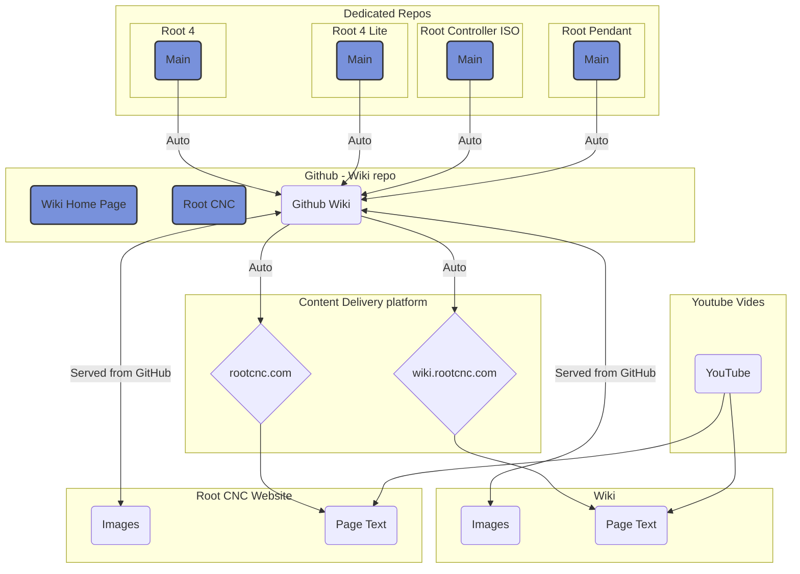

# Contribute to the Project!
Root CNC is a free open source project and if you find something which isn't complete or you will like to make an improvement, then please let me know to make it better for everyone else! Even better, make the changes your self and it'll transfer across the multiple platforms - Its super easy!

## How files are managed?
Root CNC uses GitHub to manage to "source of truth" files. GitHub is where you'll find the latest information and where all other information stems from. If you see files on other sites, such as Thingiverse, Grabcad, Etc; then its highly likely this information is old - always try and download from GitHub!

GitHub has a number of repositories (repo) that hold the data for a given project, at the time of writing there are a number of sections you'll need to be familiar with:

 1. CNC Machines - These are the Root CNC starting from Root 2 through to Root 4 including the "Lite" Machines.
 2. Electronics - Root Controller and the Root Pendant
 3. Software - Tools created to help use your machine

GitHub also is the single source of truth for other places of information, such as the main [Root CNC](https://rootcnc.com/) website and the [Wiki](https://wiki.rootcnc.com/) site you are reading now. Each individual repo that makes up the Root CNC eco systems as a number of files and folders that get collected into one main repo. This is called the Wiki Repo. This Wiki repo is the storage point which delivers the content to the other platforms. in order to changes this, you'll need to raise a PR for the given repo, IE the Root 4 Main branch. Once the PR has been merged, those changes are automatically transferred to the Wiki Repo, where the website and Wiki site will, in time look for the changes and integrate them. This can taken over 1 day to complete and maybe longer, depending if pages have been cached through our Cloudflare service. 

Below is a visual depictions on how the system chain works:

Items in Blue are PR-able. If you want anything changed, then please change it here!

### Exceptions to the rules above
The Wiki have a few other pages that it servers that sit outside that of the single source of truth repos. This is information that is used purely for the Wiki and are content managed as so by GitHub. These are any files contained with the "Root CNC" folder. if you would like to edit these files; then please raise a PR for this folder only. all other folders get overwritten when a PR occurs in another of the other repos.
#### Support
This project is a hobby of mine and I cannot do it all! I only have so much free time to tinker around with CNC machines, Electronics and DIY. so if you like the work, please consider supporting it in any way possible! 

Delivered for :free: - made with :love_letter: - Inspired by :construction_worker: (you) 